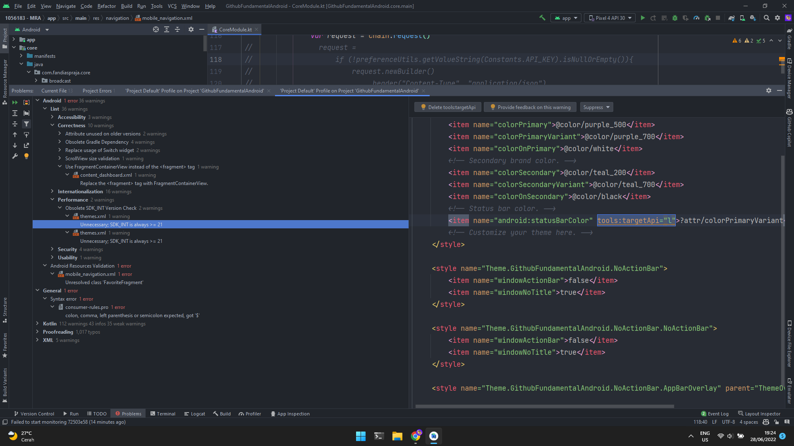
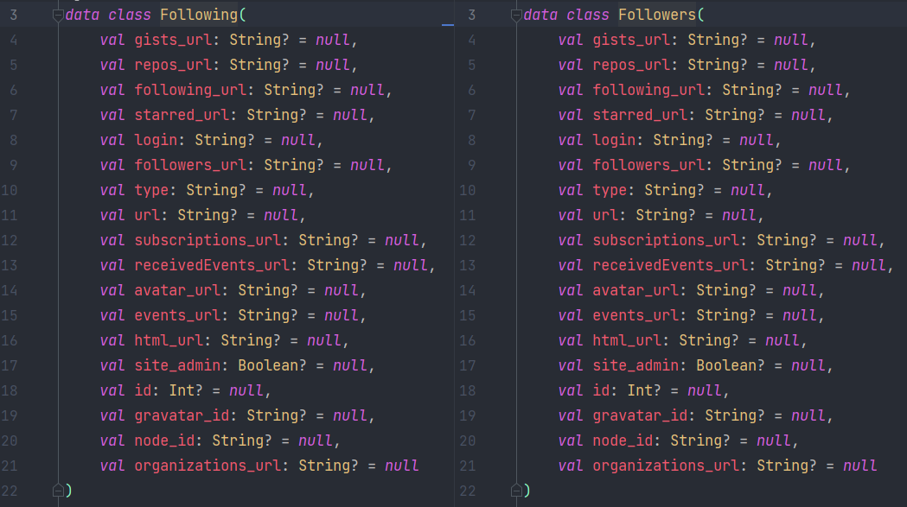
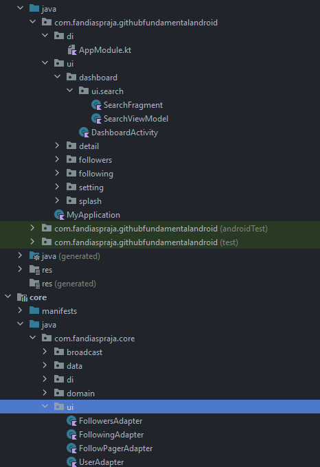
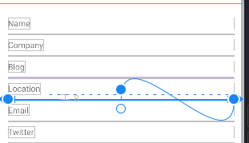
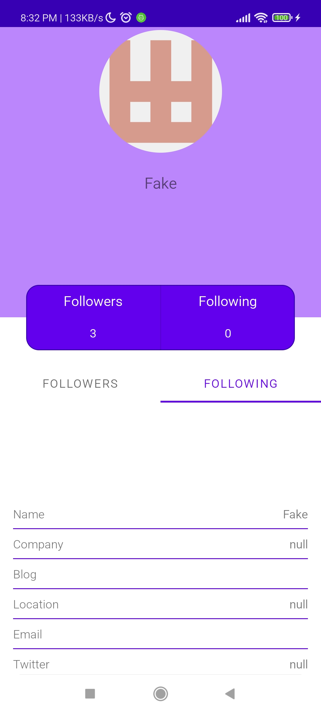

# Project: 1056183 - MRA

## Status: Submission Rejected

- Terdapat [Memory Leak](images/1056183_02.jpg) saat dianalisa menggunakan Leak Canary
- Terdapat issue terkait performance saat dilakukan Inspect Code



## Summary Projects

- Kode yang tidak pernah digunakan baik itu *Class*, *method*, ataupun *variable* jika tidak digunakan sebaiknya dihapus. Kamu bisa memanfaatkan `Analyze - Code Cleanup` untuk melakukannya dengan cepat.
- Dalam menulis sebuah kode di dalam sebuah kelas, selalu perhatikan *import* yang tidak pernah digunakan agar kode yang sudah ditulis menjadi lebih bersih dan enak dilihat. Kamu bisa melakukan `reformat code` dan `optimized import` supaya code lebih rapi dan bersih dari *import* yang tidak digunakan.
- Sudah menerapkan Security dengan tepat, seperti Obfuscation ProGuard, Enkripsi Database, dan Certificate Pinning ke server.
- Terapkan *Best Practice* dengan mengikuti apa yang di rekomendasikan pada `Inspect Code`
- Perbanyak referensi pembuatan UI untuk *mobile*, seperti [Dribbble](dribbble.com/tags/mobile_app), [Material Design](https://material.io/), dll

### Code Reviewer

```gradle
externalNativeBuild { }
```

> Anda dapat menghapus fitur `build Native` menggunakan C++, karena tidak termasuk dalam kriteria project dan tidak digunakan dalam *project* anda.

```kotlin
//    single<IServiceRepository> { ServiceRepository(get(), get()) }
//    single<IFamiliesRepository> { FamiliesRepository(get(), get()) }
//    single<INotificationRepository> { NotificationRepository(get(), get())} 
```

> Kode yang tidak pernah digunakan lebih baik dihapus untuk memudahkan membaca kode

```gradle
implementation 'androidx.appcompat:appcompat:1.4.1'
implementation 'com.google.android.material:material:1.5.0'
implementation 'androidx.constraintlayout:constraintlayout:2.1.3'
```

> Beberapa dependensi ini sudah dideklasi di dalam berkas shared_dependencies, sehingga sudah tidak perlu ditambahkan lagi.

```gradle
implementation "com.google.android.play:core:1.7.3"
```

> Dependensi ini sudah tersedia versi terbarunya `1.10.3`. Silakan diupdate beserta dependensi lainnya

```gradle
implementation 'androidx.navigation:navigation-fragment-ktx:2.3.5'
implementation 'androidx.navigation:navigation-ui-ktx:2.3.5'
```

> Dependensi ini dapat dikelola dengan menggunakan *extension* pada `root gradle`, dengan isi versi tebaru `2.4.2`

```gradle
ext.datetime_version = "3.0"
// implementation 'com.github.thunder413:DateTimeUtils:3.0'
```

> Anda dapat menghapus beberapa dependensi yang tidak digunakan untuk mempermudah pengelolaan dependensi dan mempercepat *build project*

```kotlin
suspend fun findAllUsergithub(): Flow<Resource<List<User>>>
suspend fun findUsergithub(id: Int): Flow<Resource<UserDetail>>
val starred_url: String? = null,
```

> Ikuti penulisan & penamaan sesuai aturan kotlin untuk fungsi maupun variabel, penulisan nama fungsi harus menggunakan huruf kecil untuk kata awal dan dilanjutkan *cammel case* untuk kata selanjutnya `findAllUserGithub()`



> Kedua class ini dapat menjadi 1 *Data class* saja



> Pisahkan core hanya untuk data, dan app untuk view dan viewModel

```kotlin
fun getDetailFavoriteOffline(idFav: Int){ }
fun observeDetailUserOffline(){ }
lateinit var preferenceUtils: PreferenceUtils
```

> Fungsi & variabel yang tidak digunakan oleh *class* lain, berikan *modifier* private

```kotlin
if (statusFavorite == false)
```

> Dapat di sederhanakan menjadi `if (!statusFavorite)`

```kotlin
private val binding get() = _binding!!
```

> Hindari *Double Bang* (!!) dalam pemanggilan `viewBinding`, gunakan *casting* sehingga menjadi `binding as FragmentHomeBinding`



> Anda dapat menggunakan `TableLayout` daripada manual `divider`

```xml
android:text="Blog"
```

> Anda dapat menggunakan `tools:text="Blog"` sebagai placeholder preview



> Anda dapat memberikan informasi tambahan ketika tidak terdapat data following
