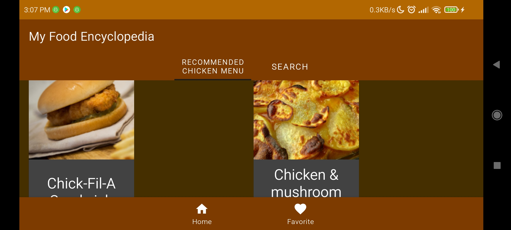

# Project: 727434 - MRC

## Status: Submission Rejected

- Project masih belum menerapkan Security: Obfuscation, SSL Pinning, dan Database Encryption
- Project masih belum menggunakan LeakCanary untuk memory leak

## Summary Projects

- Kode yang tidak pernah digunakan baik itu Class, method, ataupun variable jika tidak digunakan sebaiknya dihapus. Kamu bisa memanfaatkan **Analyze - Code Cleanup** untuk melakukannya dengan cepat.
- Project sudah menerapkan konsep SOLID, Clean Architecture dengan bagus dan tepat.
- Manfaatkan `shared_dependency` untuk menghindari penulisan dependency berulang pada beberapa `module` dan mempermudah mengatur versi dependency.
- Selalu perhatikan `TODO` yang tertulis pada menu `TODO` agar tidak ada yang terlewat.
- Anda dapat menggunakan arsitektur *Single Activity* untuk mengganti penggunaan *Activity* dengan *Fragment*.

### Code Reviewer

```gradle
implementation 'androidx.constraintlayout:constraintlayout:2.0.4'
implementation 'com.google.android.material:material:1.3.0'
implementation 'androidx.appcompat:appcompat:1.2.0'
implementation "io.insert-koin:koin-android:3.1.2"
implementation 'org.jetbrains.kotlinx:kotlinx-coroutines-android:1.6.0'
```

> Pastikan selalu versi *dependency* yang terbaru, jika *dependency* mempunyai versi yang sama tuliskan pada file `build.gradle` level root atau project.

```gradle
targetSdkVersion 31
```

> Selalu pastikan untuk memperbarui `targetSdk` terbaru, yaitu versi `32`.

```kotlin
// HomeActivity.kt
bind.bottomNavigationView.setOnNavigationItemSelectedListener { }

bind.bottomNavigationView.setOnItemSelectedListener { }
```

> Anda dapat mengubah fungsi `setOnNavigationItemSelectedListener` yang sudah *deprecated* dengan `setOnItemSelectedListener`

```xml
<!-- Default (Day value) -->
<style name="Theme.MyFoodEncyclopedia" parent="Theme.MaterialComponents.DayNight.NoActionBar">

<!-- Night value -->
<style name="Theme.MyFoodEncyclopedia" parent="Theme.MaterialComponents.DayNight.DarkActionBar">
```

> Pastikan untuk menggunakan *parent* yang sama jika ada 2 *value* yang berbeda untuk tema. Jika tidak, aplikasi akan *force close* ketika pengguna menggunakan *Dark Mode*, atau gunakan 1 *value* tema saja.

```kotlin
notifyDataSetChanged()
```

> Anda dapat mengganti `notifyDataSetChanged()` dengan implementasi `DiffUtil`

```xml
<!-- per_item.xml -->
android:layout_width="180dp"
```



> Gunakan `match_parent` untuk item recyclerview, untuk mendukung layar secara *landscape*

```xml
android:layout_marginStart="12dp"
android:layout_marginEnd="12dp"
```

> Anda dapat menggunakan `layout_marginHorizontal` untuk mempersingkat penulisan

```kotlin
private val bind get() = binding!!
```

> Hindari penggunaan *Double Bang* (!!) pada pemanggilan `viewBinding`, gunakan *casting* sehingga menjadi `binding as FragmentHomeBinding`

```kotlin
title = "Favorite Meal"
```

> Anda dapat mengganti string *Hardcode* dengan `string resource` untuk mendukung lokalisasi
